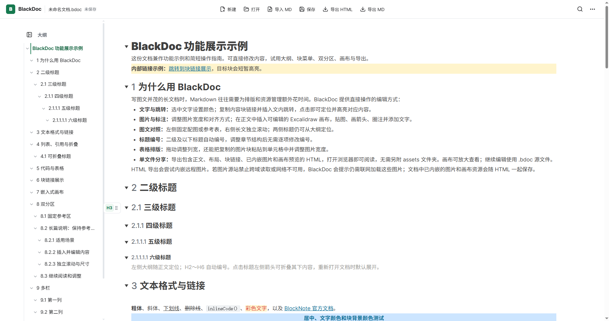

# BlackDoc



BlackDoc 是一款基于 BlockNote 和 Tauri 的 Windows 桌面块编辑器。文档以可继续编辑的 `.bdoc` 文件保存在本地，也可以导出为便于分享的单文件 HTML。

## 下载

Windows x64 安装包以 [GitHub Releases](https://github.com/inuyasha1692/BlackDoc/releases) 页面实际发布的版本为准；首次发布前该页面没有可下载的安装包。安装后可在【更多操作】→【关于与更新】检查更新，并通过应用内下载、查看进度和重启完成安装。

## 文件格式与内容提取

BlackDoc 将文档保存在本地的 `.bdoc` 文件中。**`.bdoc` 使用明文 JSON 格式保存**，可以用文本编辑器直接打开，查看其中的文字和文档结构。

即使以后没有安装 BlackDoc，你仍然可以取出文档内容：

- **文字与表格**：可以借助 AI 或脚本提取，转换为 Markdown、纯文本等格式。
- **内嵌图片**：图片数据随文档保存，可以通过脚本解码提取。
- **画布与布局**：文件保留对应的结构数据，完整还原显示效果需要相应的渲染工具。

如果 AI 工具不接受 `.bdoc` 文件，可以将**文件副本**的扩展名改为 `.json` 后交给它处理。对于包含大量图片的大文件，可以让 AI 编写提取脚本，在本机处理。

需要直接阅读或分享时，也可以在 BlackDoc 中导出单文件 HTML，用浏览器打开。

## 为什么用 BlackDoc

写图文并茂的长文档时，Markdown 往往需要为排版和资源管理额外花时间。BlackDoc 提供直接操作的编辑方式：

- **文字与跳转**：选中文字设置颜色；复制内容块链接并插入文内跳转，点击即可定位并高亮对应内容。


- **图片与标注**：调整图片宽度和对齐方式；在正文中插入可编辑的 Excalidraw 画布，贴图、画箭头、圈注并添加文字。

- **图文对照**：左侧固定配图或参考表，右侧长文独立滚动；两侧标题仍可从大纲定位。

- **标题编号**：二级及以下标题自动编号，调整章节结构后无需逐项修改编号。
- **表格排版**：拖动调整列宽，还能把复制的图片块粘贴到单元格中并调整图片宽度。
- **单文件分享**：导出包含正文、布局、块链接、已内嵌图片和画布预览的 HTML，打开浏览器即可阅读，无需另附 `assets` 文件夹。画布可放大查看；继续编辑使用 `.bdoc` 源文件。

HTML 导出会尝试内嵌远程图片。若图片源站禁止跨域读取或网络不可用，BlackDoc 会提示仍需联网加载这些图片；文档中已内嵌的图片和画布资源会随 HTML 一起保存。

## 还有这些能力

文档默认提供本地 AI 连接，可让 Codex 等工具修改当前打开的文档，修改支持撤销并自动保存。操作步骤见 [AI 文档连接](docs/ai-document.md)。

BlackDoc 保留 BlockNote 的文本格式工具栏、`/` 插入菜单、表格、列表、媒体等编辑体验，并接入官方多栏、图表和数学公式扩展。左侧大纲、块链接、双分区、Excalidraw 画布、查找替换、自动暂存和主题切换由 BlackDoc 提供或定制。还支持折叠标题下的内容、框选并拖动多个块，以及将复制或剪切的图片块粘贴到表格单元格。

## 许可证

BlackDoc 自身代码采用 GNU General Public License v3.0 only（GPL-3.0-only），详见仓库根目录的 [LICENSE](LICENSE)。第三方依赖、字体和其他资源仍按各自许可证授权，清单见 [第三方许可声明](THIRD_PARTY_NOTICES.md)。

## 试用功能示例

下载并用 BlackDoc 打开[功能展示示例](files/BlackDoc功能展示示例.bdoc)，可以检查原生编辑操作和 BlackDoc 的特色功能。双分区章节展示左侧固定参考表、右侧滚动阅读长篇说明。

图文操作提示见[使用指南](docs/user-guide.md)，可直接在浏览器中阅读。

## 开发运行

Windows 桌面开发需要 Node.js、Rust MSVC 工具链、Visual Studio C++ Build Tools（含 Windows SDK）和 WebView2：

```powershell
npm install
npm run desktop:dev
```

也可以双击仓库根目录中的 `启动 BlackDoc 开发版.cmd`。开发中的前端修改会热更新；日常调试不需要重复安装客户端。

`npm run desktop:build` 可构建 Windows 安装包。开发时 Tauri 会自动启动 Vite 供客户端 WebView 加载；直接在浏览器打开该地址不会启动编辑器。客户端开发与验收步骤见[客户端说明](docs/desktop.md)。
