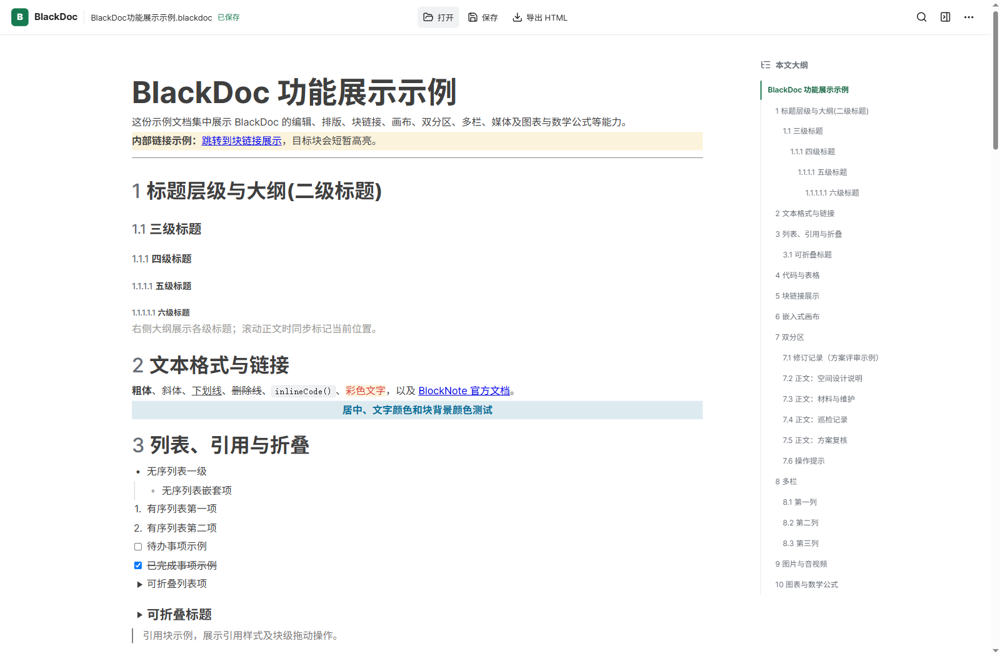
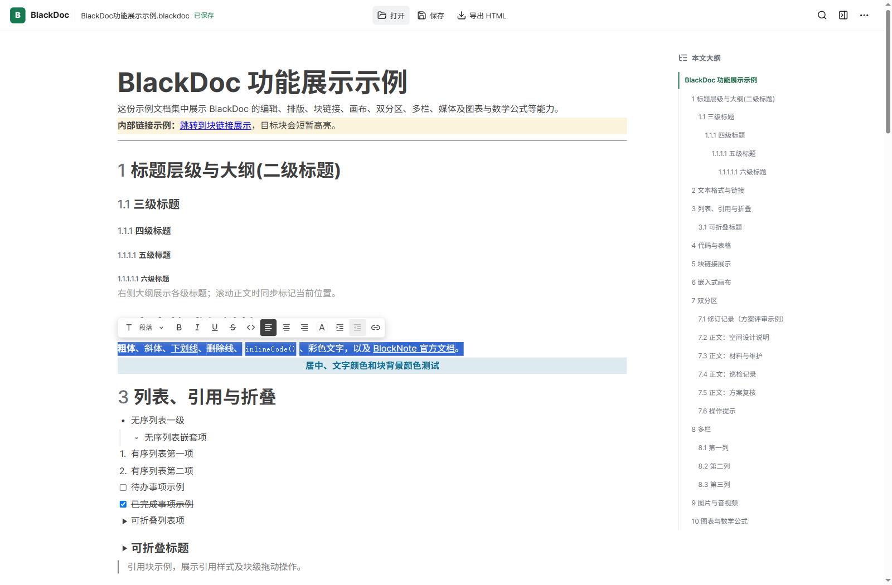
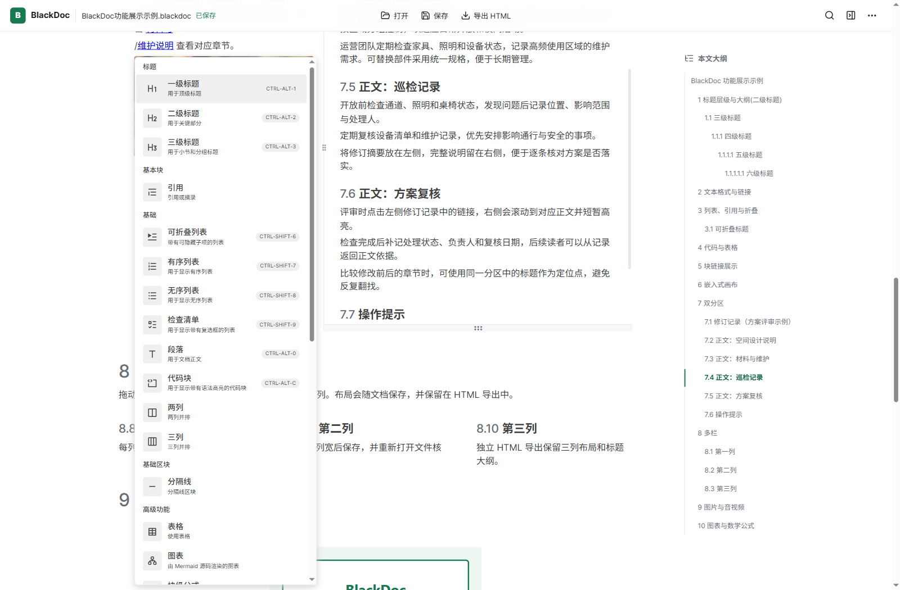
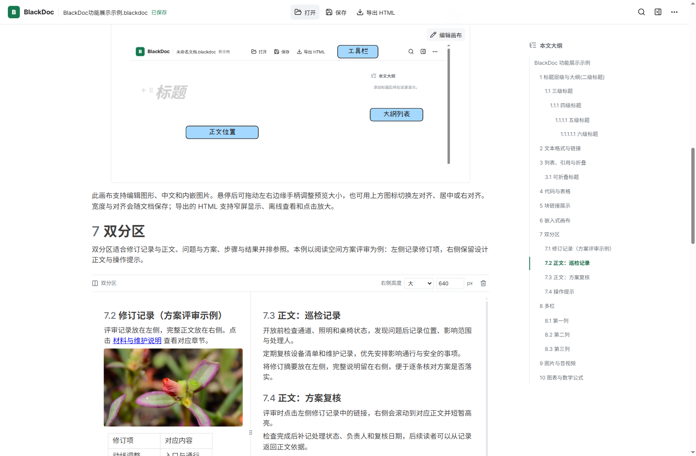
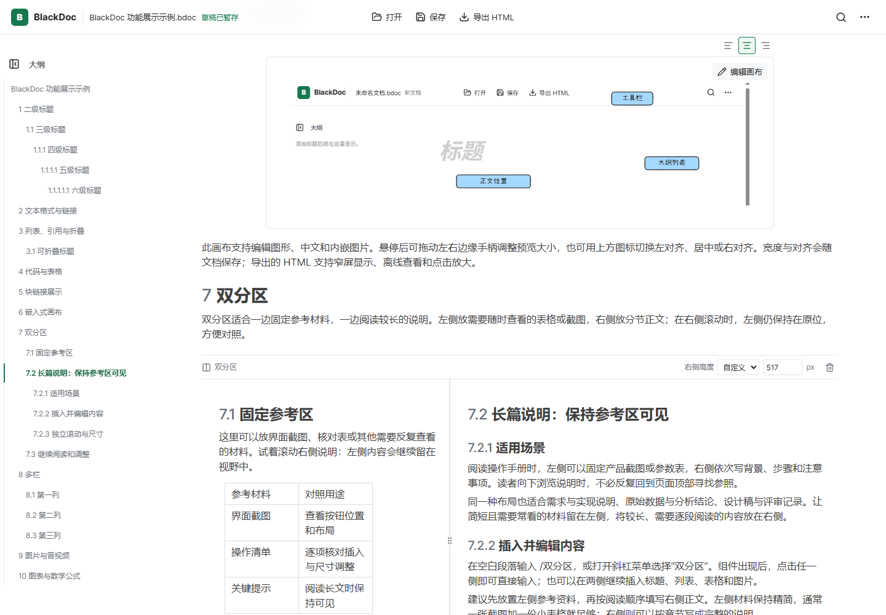
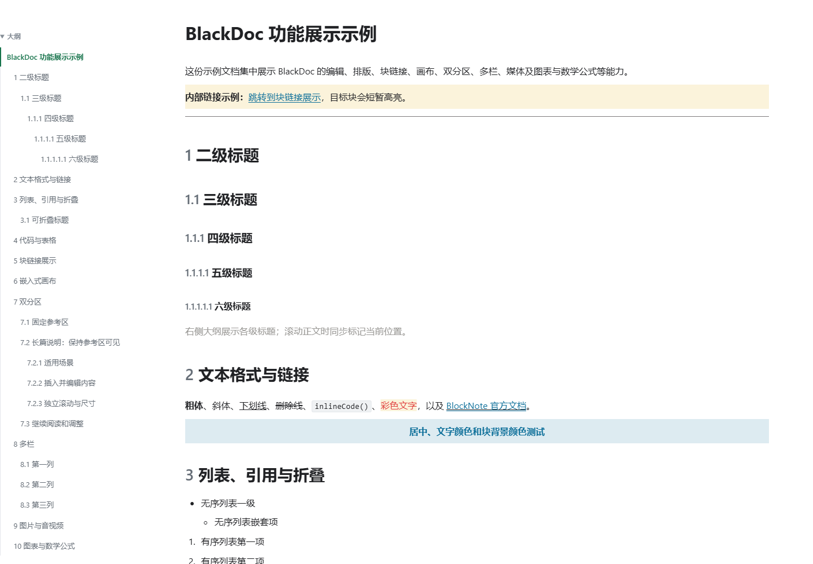

# BlackDoc 使用指南

本指南使用[功能展示示例](../files/BlackDoc功能展示示例.bdoc)演示操作。示例中的文字、图片、画布和布局都可以编辑；以下截图展示实际界面。

## 打开、编辑与保存

点击顶部【打开】载入 `.bdoc` 文档。编辑后 BlackDoc 会自动保存到已打开的文件；首次手动保存或使用【另存为】时选择本地路径。尚未选择正式文件前，内容会暂存在本机草稿中。

`.bdoc` 保留 BlockNote 块结构和可编辑的画布数据。顶部可见当前文件名与保存状态，常用的打开、保存、导出操作始终可用；其他操作收在【更多操作】菜单中。

## 文本格式与插入内容

选中文字后会出现格式工具栏，可设置粗体、斜体、下划线、删除线、行内代码、链接和颜色。字体颜色与背景颜色使用横向色板；选择链接后可通过【编辑】修改链接目标。

在空白段落输入 `/` 打开插入菜单。可以搜索块名称，也可以继续输入关键词缩小结果。段落、标题、列表、引用、代码块、表格、图片和媒体等常用块来自 BlockNote；图表、数学公式和多栏使用 BlockNote 官方扩展；“双分区”和“画布”是 BlackDoc 添加的项目块。

插入表格后可在单元格中编辑内容；插入图片或音视频块后，媒体仍作为文档块参与编辑和导出。更多操作菜单中还提供 Markdown 导入、查找替换、主题、快捷键和版本信息。

## 大纲与块链接

左侧大纲按标题层级列出文档内容。点击标题可定位；滚动正文时，当前标题会同步高亮。二级及以下标题会自动编号，编号也会出现在大纲和 HTML 导出中。

创建块链接的常用方法：

1. 将鼠标移到目标块，在块侧边菜单中选择【复制块链接】。
2. 选中准备作为链接文字的内容，点击格式工具栏的链接按钮，或按 `Ctrl+K`。
3. 粘贴块链接并确认。直接把块链接粘贴到正文，也会保留为可点击链接。
4. 点击链接后，BlackDoc 会滚动到目标块并短暂高亮；悬停在已有链接上可打开编辑入口。

块链接可用于从目录、会议纪要或问题清单跳回文档里的依据段落。功能示例的“块链接展示”章节提供了独立示例。

## 双分区与多栏

### 双分区

在空白段落输入 `/双分区`，在左右区域分别编辑。它适合把截图、参数表或操作清单固定在左侧，同时在右侧展示长篇说明。

拖动中间分隔线调整左右宽度；拖动右侧下缘手柄或使用高度控制调整右侧区域。鼠标位于右侧时可独立滚动其内容，左侧参考材料保持原位；左右标题都会进入大纲，点击标题可定位。

### BlockNote 官方多栏

在空白段落输入 `/两列` 或 `/三列`。拖动列间分隔线调整宽度，也可以把普通内容块拖到相邻列。列中仍可使用标题、段落、表格和图片。多栏数据会保存到 `.bdoc`，HTML 导出会保留布局。

图表和数学公式同样可从 `/` 菜单插入；行内公式可通过格式工具栏的块类型选择器添加。

## 嵌入式画布

输入 `/画布` 插入画布，点击画布预览进入 Excalidraw 编辑器。使用工具栏绘制形状、连线、文字或加入图片，完成后关闭编辑器回到正文。悬停预览可拖动边缘调整宽度，画布上方可以选择靠左、居中或靠右对齐。

画布数据和画布内图片保存在 `.bdoc` 中，之后仍可继续编辑；自动保存会记录画布修改。导出 HTML 后画布变为可放大查看的静态图，不再提供编辑器。

## 导出与分享

点击顶部【导出 HTML】即可生成一个独立 HTML 文件。文件内包含正文、样式、脚本、文档大纲、块链接、双分区、多栏和画布的静态预览，适合发给没有 BlackDoc 的同事查看。

文档内嵌的图片、画布预览和画布所用图片会写入同一个 HTML。远程图片会尝试内嵌；如果源站的跨域策略或网络限制阻止读取，导出时会提示这些图片仍需联网加载。HTML 中画布可放大查看，但不能编辑；要继续编辑请使用 `.bdoc` 源文件。

## 功能来源

| 能力 | 来源 |
| --- | --- |
| 段落、标题、列表、引用、代码、表格、常用媒体与文本格式工具栏 | BlockNote 原生编辑器 |
| 多栏、图表、数学公式 | BlockNote 官方扩展 |
| 左侧大纲、自动标题编号、当前文档块链接、双分区、Excalidraw 画布 | BlackDoc 自定义或集成 |
| 自动保存与草稿恢复、查找替换、自定义颜色色板、Markdown 导入、主题切换、版本与更新入口 | BlackDoc 自定义 |

Windows 客户端的开发与验收步骤见[客户端说明](desktop.md)。
