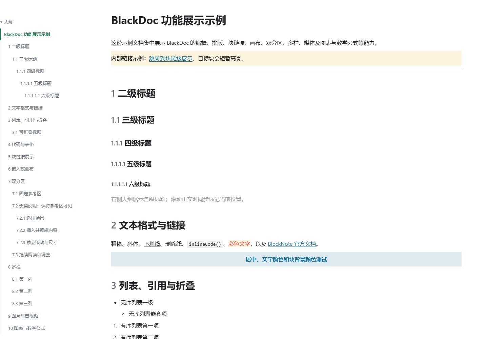
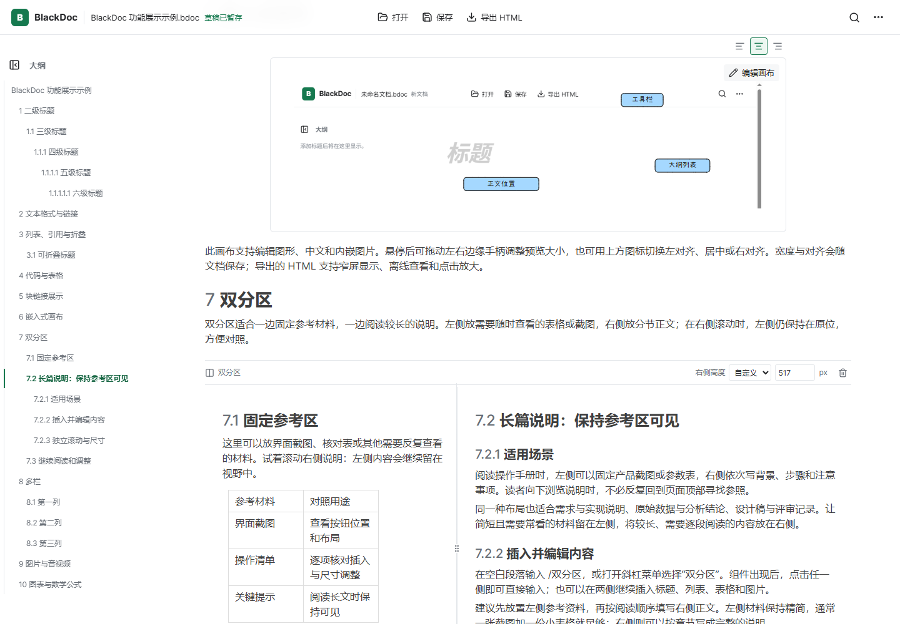

# BlackDoc 使用指南

本页可直接用浏览器或 Markdown 阅读器查看，无需安装 BlackDoc。想在编辑器里动手试用时，可打开[功能展示示例](../files/BlackDoc功能展示示例.bdoc)。

首次启动会自动打开功能示例；之后也可从【更多操作】打开【功能示例】。

## 文档与分享

`.bdoc` 是可继续编辑的源文件，包含块结构和画布数据。已打开的文件会自动保存；首次保存前，内容暂存在本机草稿中。顶部显示文件名和保存状态。

【导出 HTML】生成便于阅读和分享的单文件，包含大纲、布局、内嵌图片和画布预览。远程图片若无法内嵌，导出时会提示仍需联网。HTML 中的画布可放大查看；继续编辑请使用 `.bdoc`。

## 编辑入口

- 输入 `/` 打开插入菜单；在已有块左侧的菜单中，将鼠标移到【在下方添加】，可直接在该块之后插入新块。
- 左侧大纲随正文定位。二级及以下标题自动编号；标题左侧箭头可折叠该标题管辖的内容，重新打开文档时默认展开。`Ctrl+0` 切换为正文，`Ctrl+1`～`Ctrl+6` 切换标题级别。
- `Ctrl+T` 插入表格。复制或剪切图片块后，在单元格内粘贴即可插入图片；悬停单元格图片可调整宽度。图片块悬停时显示工具栏，可放大查看或从块菜单设置缩进、对齐。
- 从正文侧边空白处拖出矩形可框选多个块，拖动选中块的左侧手柄可整体移动。复制、剪切和删除也作用于选区；按 `Esc` 退出多选。

## 块链接

在目标块的左侧菜单选择【复制块链接】，再给链接文字设置该地址。点击链接会定位并高亮目标块；导出的 HTML 也支持同页跳转。示例文档开头有一条可直接点击的内部链接。

## 导出 Markdown

点击【导出 MD】选择保存位置。内嵌图片、音视频和附件写入同目录的 `assets` 文件夹，并使用相对路径引用；分享时请一起携带该文件夹。资源文件名包含内容摘要，重复导出复用相同资源，已有不同内容的同名文件会报错。

双分区优先转为“图片 / 说明”Markdown 表格，单元格使用 ` ` 换行，小图标与后续说明同行；图片尺寸和颜色使用行内 HTML。包含嵌套表格等复杂块时使用 HTML 表格保留内容。简单左图右说明多栏转为两列表格，复杂多栏按从左到右展开。折叠和滚动区域里的正文全部保留。文字和背景颜色用内嵌 HTML 表达，复杂表格使用 HTML 表格，图片宽度通过 HTML 图片属性保留。自动标题编号不写入正文，文内块链接转成显式锚点。

图表输出 Mermaid 代码块，公式保留 LaTeX 源码；Typora 需启用图表及行内公式。画布输出 SVG 预览及 `.excalidraw` 源文件链接。外部资源保留原链接，导出结果提示需要转换的内容。MD 重新导入可恢复部分结构，原始分栏尺寸、折叠状态和画布编辑结构仍需使用 `.bdoc` 源文件。

## 双分区、多栏与画布

`/双分区` 适合左侧固定截图或表格、右侧阅读长篇说明。拖动中间分隔线调整宽度；右侧可独立滚动，并可从下缘手柄或高度控制调整可视高度。两侧标题都可从大纲定位。

`/两列`、`/三列` 使用 BlockNote 官方多栏，可调整列宽和移动列内普通块。Markdown 导入的表格保留为表格，单元格内的图片保留在对应位置。

`/画布` 插入可编辑的 Excalidraw 画布；点击预览进入编辑。画布数据保存在 `.bdoc`，导出 HTML 后显示为可放大的静态图。

功能示例文档可直接试用上述布局和操作。客户端开发与验收步骤见[客户端说明](desktop.md)。
